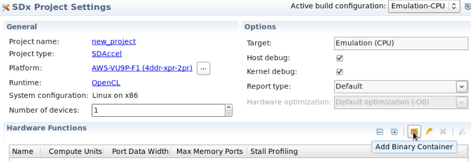
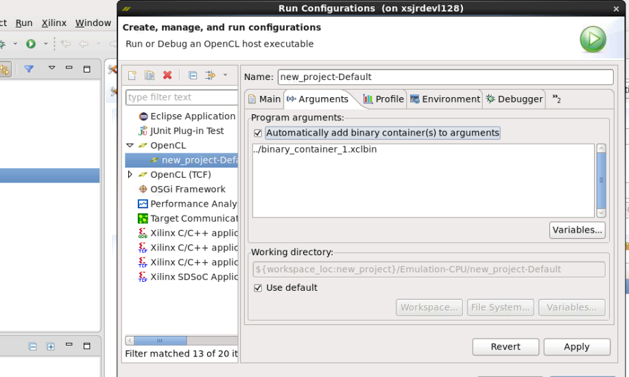
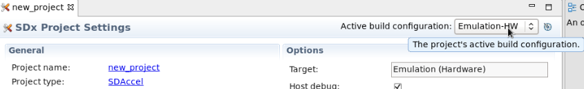
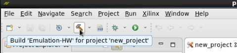
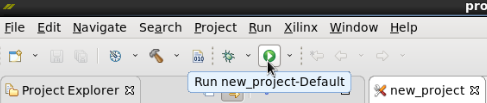
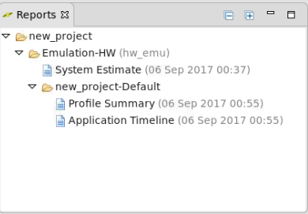

# Using the SDAccel GUI

The SDAccel GUI allows to control all aspects of an SDAccel project. 

The guide explains how to:
1. Create an SDAccel project.
1. Verify the application. 
1. Execute on the FPGA hardware.

This tutorial uses the vadd_kernel example from the Github. 

## Cloning the aws-fpga Git repository
The AWS Github repository contains the example used in this tutorial.  

Execute the following commands on your local machine to clone the Github repository and configure the SDAccel environment:
```
    $ git clone https://github.com/aws/aws-fpga-preview.git
    $ cd aws-fpga-preview                                      
    $ source sdaccel_setup.sh
```

# 1. Create an SDAccel project

The SDAccel GUI is invoked by typing **sdx** at the command line.

```
    $ sdx
```
The SDAcel firsts asks you to specify a workspace. This is a directory on the disk where your project will be created. You can accept the default path or use the the **browse** button and navigate to a different directory, or create a new one. After specifying a path for your project, select **OK**. 

- From the Welcome Screen, select **File** > **New** > **Xilinx SDx Project..**. 
- Specify a name for the project, e.g. **GUI_test** and select **Next**.
- Select the AWS Platform and select **Next**.
- Click **Next** to accept the default Software Platform. 
- Finally, select **Empty Application** and select **Finish**. 

The SDAccel opens with an empty project ready for you to start. Use **File** > **Import** > **General** > **Filesystem** and select **Next*.
Browse to the source files or the vadd_kernel directory ....**UDay need path here** and select the application files.

**Note**, this example uses an RTL kernel and contains a .xo file. For OpenCL projects, select the kernel file(s) instead.


Your project is now complete and ready to use.

# 2. Verify the application

The application is now ready to be verified.

The first step is to add container. Select **Add Binary Container**.



The next step is to ensure the binary container is always added to the project. 

- Select **Run** > **Run Configuration**.  
- Open the **Arguments** tab. 
- Select **Automatically run binary container(s) to arguments** as shown below. 



There are two emulation flows that can verify the application. 
- Software Emulation
- Hardware Emulation

This example project is an RTL kernel example and hence SW Emulation cannot be run. However, the same basic steps are used to run both SW Emulation and HW Emulation. If you wish to run SW Emulation with a different example, simply leave the **Active Build Configuration** used in the next steps flow at ** CPU-Emulation** to run SW Emulation.
	   
Specify the emulation mode as Hardware Emulation.

- In the SDx Project Settings, select **Emulation-HW** as the **Active Build Configuration**.  




The application will now be run in HW Emulation mode. 

- Click on the **Build** toolbar button to build for HW Emulation.
 


After the completion of the Build process, you can run Hardware Emulation flow by clicking on the Run Icon. 
 


After the completion of Hardware emulation run, in the Reports tab, you can inspect various reports, such as **System Estimate**, **Profile Summary** and  **Application Timeline**. 




The next step of the flow is to run the appliction on the FPGA hardware.

# Execute on the FPGA hardware

Before the application can be run on the AWS F1 instance, you need to ceate an AFI. 

[Instructions on how to create and AFI, ...](https://github.com/aws/aws-fpga-preview/blob/master/sdk/SDAccel/README.md#create-an-amazon-fpga-image-afi-for-your-kernel)

# Additional Resources

The [AWS SDAccel README].

Xilinx web portal for [Xilinx SDAccel documentation] and for [Xilinx SDAccel GitHub repository]

Links pointing to **latest** version of the user guides
1. [UG1023: SDAccel Environment User Guide][latest SDAccel Environment User Guide]
1. [UG1021: SDAccel Environment Tutorial: Getting Started Guide (including emulation/build/running on H/W flow)][latest UG1021]
1. [UG1207: SDAccel Environment Optimization Guide][latest SDAccel Environment Optimization Guide]
1. [UG949: UltraFast Design Methodology Guide for the Vivado Design Suite][latest UG949]

Links pointing to **2017.1** version of the user guides
1. [UG1023: SDAccel Environment User Guide][UG1023 2017.1]
1. [UG1021: SDAccel Environment Tutorial: Getting Started Guide (including emulation/build/running on H/W flow)][UG1021 2017.1]
1. [UG1207: SDAccel Environment Optimization Guide][UG1207 2017.1]
1. [UG1238: SDx Development Environment Release Notes, Installation, and Licensing Guide][UG1238 2017.1]

[SDAccel_landing_page]: https://www.xilinx.com/products/design-tools/software-zone/sdaccel.html
[VHLS_landing_page]: https://www.xilinx.com/products/design-tools/vivado/integration/esl-design.html
[Vivado_landing_page]: https://www.xilinx.com/products/design-tools/vivado.html

[latest SDAccel Environment User Guide]: https://www.xilinx.com/cgi-bin/docs/rdoc?v=latest;d=ug1023-sdaccel-user-guide.pdf
[latest UG1021]: https://www.xilinx.com/cgi-bin/docs/rdoc?v=latest;d=ug1021-sdaccel-intro-tutorial.pdf
[latest SDAccel Environment Optimization Guide]: https://www.xilinx.com/cgi-bin/docs/rdoc?v=latest;d=ug1207-sdaccel-optimization-guide.pdf
[latest UG949]: https://www.xilinx.com/cgi-bin/docs/rdoc?v=latest;d=ug949-vivado-design-methodology.pdf

[UG1023 2017.1]: https://www.xilinx.com/support/documentation/sw_manuals/xilinx2017_1/ug1023-sdaccel-user-guide.pdf
[UG1021 2017.1]: https://www.xilinx.com/support/documentation/sw_manuals/xilinx2017_1/ug1021-sdaccel-intro-tutorial.pdf
[UG1207 2017.1]: https://www.xilinx.com/support/documentation/sw_manuals/xilinx2017_1/ug1207-sdaccel-optimization-guide.pdf
[UG1238 2017.1]:http://www.xilinx.com/support/documentation/sw_manuals/xilinx2017_1/ug1238-sdx-rnil.pdf
[Xilinx SDAccel documentation]: https://www.xilinx.com/products/design-tools/software-zone/sdaccel.html#documentation
[Xilinx SDAccel GitHub repository]: https://github.com/Xilinx/SDAccel_Examples

[AWS SDAccel Readme]: ../README.md
[RTL Kernel Wizard]:https://www.youtube.com/watch?v=IZQ1A2lPXZk