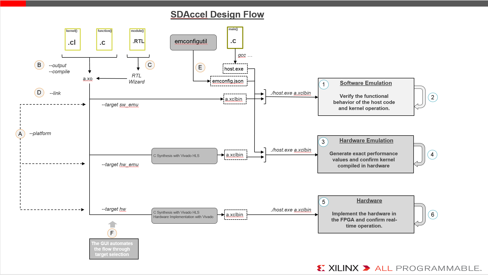
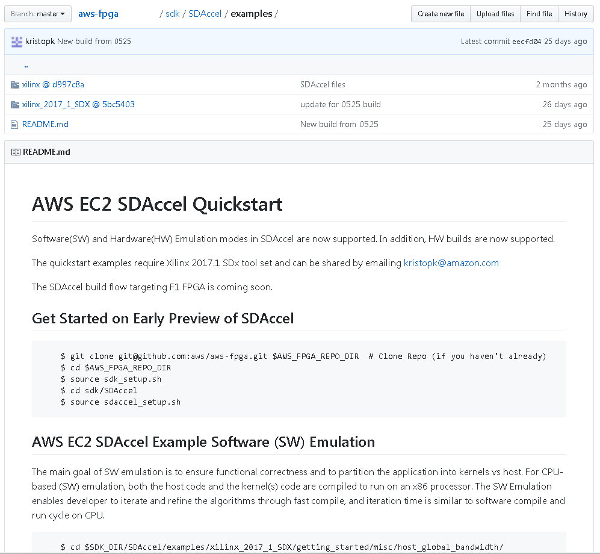
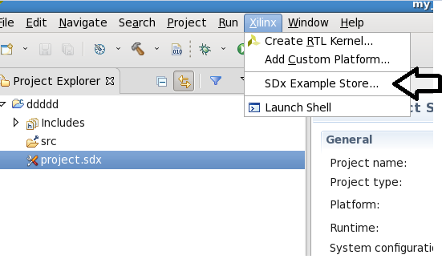
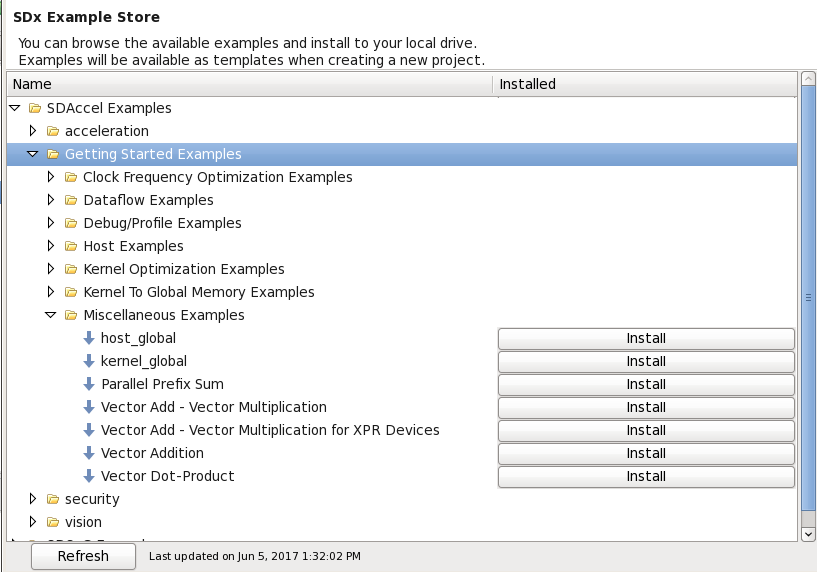
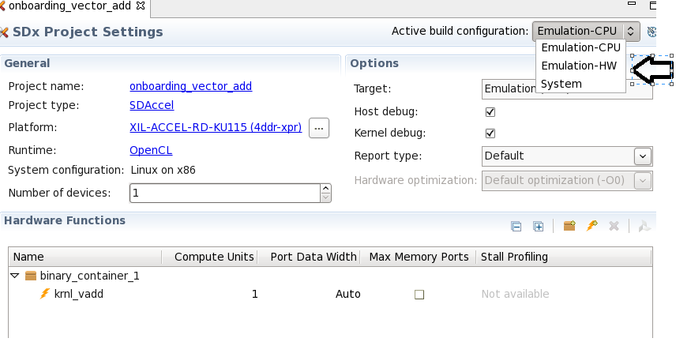
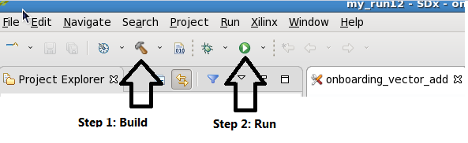
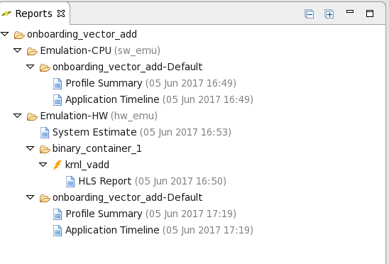

# SDAccel Short but Detailed Guide: Flow for Amazon F1
> It is assumed that the reader has run the instruction in the [AWS SDAccel README] successfully in order to be acustomized to the general flow. 


This document provides a detailed reference to the [SDAccel Development Environment][SDAccel_landing_page] and use for AWS F1 FPGA instances. 
The SDAccel environment allows kernels expressed in OpenCL or C/C++ to be accelerated by implementing them in custom FPGA hardware. The flexible SDAccel Development Environment also allows the acceleration to be performed using pre-existing RTL designs as well. 
This Guide provides you with the following concepts and work flows:
* [Gain an understanding of the SDAccel **Design** Flow](#design)
* [A complete **Methodology** for using the SDAccel Development Environment effectively](#methodology)
* [How to work with **examples**](#onboarding_examples)
* [Run a sample design on **GUI**](#working_with_examples)
* [Frequently Asked Questions (**FAQ**)](#FAQ)

SDAccel uses the compiler named `xocc` which can be thought of similar to the gnu gcc compiler -i.e. it allows to compile source code to create Xilinx object (.xo) files and then can link said .xo files together to create an executable program; the .xo files contain an RTL representation of the accelerated kernels and the executable program is the design to be programmed onto the AWS F1 FPGA. 

When the source code is OpenCL or C/C++ the [Vivado High-Level Synthesis (HLS)][VHLS_landing_page] tool is used under the hood to create the RTL that aims to match the required performance and then an .xo file is created using the [Vivado toolchain][Vivado_landing_page].

When the source code is RTL, then the Vivado tool creates the .xo file directly without using Vivado HLS.

SDAccel also uses a `platform` which contains the AWS F1 Shell and a set of IPs needed for SDAccel to interface with the kernels. 

This document further describe the above and links to documentation or concepts discussed in the [AWS SDAccel README] and/or in the [Xilinx SDAccel documentation]. 
> Note: the initial version of this document used the 2017.1 documentation version. 


## SDAccel Design Flow
The figure below shows:
1. The [design flow](#design) overview on the left hand side, and uses the `xocc` options names,
1. The [methodology flow](#methodology) on the right hand side.



Figure: SDAccel Design Flow for Amazon F1

<a name="design"></a>
# Design Flow (left hand side of chart)

As described in the [AWS SDAccel README], the SDAccel Development Environment enables the integration of accelerator kernels into a design to be programmed on the AWS F1 FPGA instances. In this section we are detailing the `xocc` command line options that are necessary to create the design to be programmed onto the AWS F1 FPGA.

**(A)**
First and foremost, `xocc` need the information about the platform it is targetting. On AWS, you must always select the target hardware using `--platform  $AWS_PLATFORM`  
The alternative forms are `--platform /PATH/TO/xilinx_aws-vu9p-f1_4ddr-xpr-2pr_4_0` or `--platform xilinx:aws-vu9p-f1:4ddr-xpr-2pr:4.0` if the platform is installed in on-premise.

Furthermore, the `--target` option allows software emulation (sw\_emu), hardware emulation (hw\_emu) or hardware FPGA (hw, default) targets to be created. Further details are provided in Chapter 4 of [latest UG1023].
- [Software Emulation target](#sw_emu_target): **Verifies the functional behavior of the host code and kernel operation via pure software execution**
- [Hardware Emulation target](#hw_emu_target): **Generates custom hardware and confirms kernel(s) performance values via RTL Simulation**
- [Hardware target](#hw_target): **Implements the RTL hardware for the AWS F1 FPGA and allows comfirmation of real-time operation on FPGA**

**(B)**
Without the `--compile` option, .xclbin files are generated: they contain the FPGA bitstream and metadata to be programmed by the host code with the OCL API clCreateProgramWithBinary() : this is the default mode. With `--compile` option, kernels or accelerator functions will be compiled into .xo files independently, in preparation for linking. The default output filename is a.xclbin or a.xo depending on `--compile` option; default name is changed with the
`--output` option. 'xo' stands for Xilinx objects files.

**(C)**
The RTL Kernel Wizard may be used to create template RTL files to be used and or modified to help create .xo files. Existing RTL designs need to have specific interfaces into compiled .xo files, specific interfaces include ARM’s AXI standard interface: AXI Master for interfacing global memory into DDR or AXI-Lite interface for control by the host and host program. RTL interface are explained in [latest UG1023] in section "Expressing a kernel in RTL"

**(D)**
If `--compile` was used to create .xo files, the `--link` flag allows multiple compiled kernel .xo files to be linked into a single xclbin file. At this stage, you may optionally link an RTL kernel (packaged .xo file).

**(E)**
For emulations compilation targets, we need a way of describing the hardware platform; this is achieving by using the emconfigutil utility: it generates a file named emconfig.json which is used by the Xilinx runtime to look-up the platform target during host code execution. This file must be in the same directory as host executable. See Chapter "Running Software and Hardware Emulation in XOCC Flow" in [latest UG1023]

**(F)**
The GUI automates the flow through the use of target selection. Example, simply select target Hardware Emulation create all performance reports and perform hardware emulation.

<a name="methodology"></a>
# Methodology Flow (right hand side of chart)

**(1)**
<a name="sw_emu_target"></a>
Software emulation confirms the functional correctness of the design and algorithm.
  - Software emulation has short compile times (does not create FPGA programming files).
  - Confirms the functionality is correct
  - Software emulation is platform independent. 
  - Review performance and implementation estimates
  - You can review the API calls in profile view or summary.
  - Source code may be optimized for FPGA similarly to other source code optimized for CPU/GPU in advance of running on the target hardware.
  - Most design refinements and code transformations may be done here.
  - Software emulation does not support kernels expressed in RTL.

**(2)**
Iterate around the Software emulation flow to create and verify the correct functionality
- Verify changes like changes in NDrange, work group size or multiple CU: adapt host code
- Adapt code for FPGA, can be, but not limited to caching of data, bursting to utilize optimum memory transfers, larger bus bitwidth for the data transfers, alternative micro-architecture exploration. See details in optimization guide [latest UG1207]
- Verify "host:kernel co-optimization" above still make sense and was not broken by using incompatible interface or different behavior to the original.

**(3)**
<a name="hw_emu_target"></a>
Hardware emulation will produce an RTL hardware model for FPGA which accurately reflects the hardware with size, implementation and performance estimates in terms of latency.
- Medium compile times
- Confirm the hardware performance estimates through profiling
- Review detailed performance traces to determine bottlenecks
- OpenCL attributes & SDAccel optimization directives to improve performance
- This is where users get hardware estimation numbers: review the reports to confirm assumptions from software emulation about data ports bitwidths on the interface, verify optimization attributes are used and behaving as expected, for example review pipelining or add pipeline attributes as needed etc See section kernel synthesis report section in [latest UG1023]
- Hardware estimation provide profiling report: review to confirm data transfers, runtime estimations, performance of kernel, transfers etc See profiling summary report section in [latest UG1023]
- Verify waveforms or debug hangs or stalls caused by overly optimized buffers. See application timeline section in [latest UG1023]

**(4)**
Perform different Hardware emulation runs to optimize the hardware or further explore tradeoffs.
- kernel compilation only to get hardware numbers estimations refinements (compile time, static behavior), reiterate to tune or tailor the hardware to reduce area (size of pipes or FIFO), decrease or increase hardware parallelization etc
- hw_emu runs to get dynamic behavior refinements: change of parallelism, optimization attributes, different work group size and compute units, interaction of kernels and memory etc
- data transfer changes and further adjustment of transfers lengths or ports data widths

**(5)**
<a name="hw_target"></a>
Hardware compilation target will create a bitstream to program the hardware target with fully accurate hardware implementation details
- Takes the longest time to compile
- Running on hardware (ie FPGA device and board) is the most accurate for the profiling
- Running on hardware should have the fastest execution time,
- Can highlight issues: meeting  timing, kernel clock changes, system failures, routing failures

**(6)**
Iterate hw runs to perform
- Hardware debug/correctness
- Absolute accurate transfers and performance numbers

<a name="onboarding_examples"></a>
# Onboarding examples

This section demonstrates how to get started using SDAccel Development Environment using the Onboarding examples. For the purpose of this demonstration, we choose a simple vector addition example from the Onboarding examples.

## Accessing through AWS Github Page for command line usage
As part of the script sdk_setup.sh, the Xilinx Onboarding examples are pulled as a submodule to the aws git checkout area in the directory sdk/SDAccel/examples. Note, they can also be pulled from Xilinx Github page or the SDAccel GUI.
https://github.com/aws/aws-fpga/tree/master/sdk/SDAccel/examples
The examples are setup to run from a makefile flow and no other changes are needed for command line interaction.



Figure: SDAccel onboarding examples submodules link on the AWS EC2 SDAccel examples

## Accessing through GUI using AWS GitHub
The github examples use a common library and those needs to be copied in the local project source folder to make it easier to use. Type the command `make local-files` to copy all necessary files in the local directory.

Secondly, when creating the project, the custom hardware platform for AWS needs to be selected via the “add custom platform...” button in hardware platforms wizard page. This is because by default no platforms are provided as part of AWS installation of SDAccel. Select “add custom platform...” and browse to the xpfm located inside the xilinx_aws-vu9p-f1_4ddr-xpr-2pr_4_0 directory; this should be $SDK_DIR/SDAccel/aws_platform/xilinx_aws-vu9p-f1_4ddr-xpr-2pr_4_0/

## Accessing through GUI outside AWS GitHub
Before using an onboarding example in the GUI, it must be downloaded as an example template. The steps to do this are described below.
* Open the SDx GUI by running the following command in the terminal window:
```
sdx
```
* Select a workspace,
* Select SDx Example Store... from the Xilinx menu (please refer to figure below)




Figure: Accessing SDx Example store through GUI

* The above step will open a dialog where you can install the desired examples (please refer figure below).



Figure: Installing Getting Started examples


<a name="working_with_examples"></a>
# Working with Onboarding examples

The directory named "getting_started" contains the onboarding examples for SDAccels. All the examples are categorized in different categories focusing on particular aspects of the coding style, for example, host code, kernel code, data movement, etc.
There are different ways to run these examples.
1. GUI flow using design files from AWS github
1. GUI flow not using design files from AWS github: the SDAccel GUI can download/install examples from [Xilinx SDAccel GitHub repository]


## GUI flow for Onboarding Examples
A project need to be created importing the source files either from outside or from inside of the AWS github sources and using the custom AWS platform DSA.
Once the project is created, we can compile and run in Software Emulation, Hardware Emulation, or Hardware mode by selecting the Active build configuration inside the SDx Project Settings as shown below:



Figure: Selection of Software Emulation, Hardware Emulation or Hardware run through GUI

After selecting the Build configuration, we can compile and run by selecting proper icon from the GUI taskbar



Figure: Compilation and execution.

You can navigate through some additional report files through the GUI



Figure: Various report files from Software and Hardware Emulation run

All the target modes generate Profile Summary.
Application Timeline view is available in hw_emu and hw targets.

Profile Summary generates profiling data on host execution and gives runtime performance estimates.

Application timeline view collects and displays host and device events on a common timeline to help you understand and visualize the overall health and performance of your systems.

Hardware Emulation mode generates a couple of additional report file as well.

System Performance estimate reports that provides information about Timing, Latency and Area information for each Kernel.

High-level Synthesis report of the Kernel code provides the performance of logic utilization of the custom generated hardware logic from the Kernel.

<a name="FAQ"></a>
# Frequently Asked Questions (FAQ)

This section lists issues/perceived issue and their associated investigations or solutions.

## What can we investigate when xocc fails with a path not meeting timing - e.g. WARNING: [XOCC 60-732] Link warning: One or more timing paths failed timing targeting <ORIGINAL_FREQ> MHz for <CLOCK_NAME>. The frequency is being automatically changed to <NEW_SCALED_FREQ> MHz to enable proper functionality.
1. Generally speaking, lowering the clock will make the design functional in terms of operations (since there will not be timing failures) but the design might not operate at the performance needed due this clock frequency change. We can review what can be done.
1. If CLOCK_NAME is `kernel clock 'DATA_CLK'` then this is the clock that drives the kernels. Try reduce kernel clock frequency see --kernel_frequency option to xocc in [latest UG1023]
1. If CLOCK_NAME is `system clock 'clk_main_a0'` then this is the clock clk_main_a0 which drives the AXI interconnect between the AWS Shell and the rest of the platform (SDAccel peripherals and user kernels). Using --kernel_frequency as above does not have any direct effect but might have side effect in changing the topology/placement of the design and improve this issue.
1. If OCL/C/C++ kernels were also used, investigate VHLS reports / correlate with kernel source code to see if there are functions with large number of statements in basic block, examples: might have unrolled loops with large loop-count, might have a 100++ latency; the VHLS runs and log files are located in the directory named `_xocc*compile*`
1. Try `xocc -O3` to run bitstream creation process with higher efforts.
1. Open vivado implementation project ```vivado `find -name ipiimpl.xpr` ``` to analyze the design; needs Vivado knowledge; see [UltraFast Design Methodology Guide for the Vivado][latest UG949]

## xocc fails due to routing/resource overflow
1. Look into utilization report
1. If OCL/C/C++ kernels were also used, look into the source code for excessive unroll happening.

## How do I open the Vivado projects created?
1. There are 2 vivado projects: 
- first one for the design in the CL, can open from command line with ```vivado `find -name ipiprj.xpr\```` to see the connectivity of the created design
- second is the implementation project ```vivado `find -name ipiimpl.xpr\` ``` to analyze the design in the place and routing design phases; needs Vivado knowledge; see [UltraFast Design Methodology Guide for the Vivado][latest UG949]

## When board execution gets wrong results or gets stuck
1. Verify hw_emu works as expected; use less data if needed in hw_emu
1. Assert where board run fails and check same conditions for hw_emu
1. See "Chapter 8 - Debugging Applications in the SDAccel Environment" in [latest UG1023]

## Loading bitstream fails or host exe has issues
1. double check that the FPGA or platform provided match xilinx:aws-vu9p-f1:4ddr-xpr-2pr:4.0 you using same board and version as DSA set for xclbin?
1. Board already in use: run xbsak with query option to check status.

## Host code failed to link
1. Is the code linking to *.so libs and are they setup correctly on the compiler command line argument
- Note, there has been issues reported where -ldl or -lxilinxopencl needed to be put as the last argument of the comman line for the compiler; try linking on the command line and see if moving the -l options corrects the issue.
1. Is LD_LIBRARY_PATH setup correctly?

## Failed to emulate
1. emconfig needed to run once to create description of HW device; the makefile should automate this.
1. Is XCL_EMULATION_MODE=true in the env or subshell?

## sw_emu passes but hw_emu fails
1. arrow down failure: what mismatches, only LSB bits different?
1. Differences due to floating point?
1. Run valgrind on executable to assert no seg faults or out of bounds accesses
1. Have a reduced testcase data size if hw_emu takes too long
1. Have sdaccel.ini configured with [Emulation] section using launch_waveform=gui or batch to generate waveform for analysis; see "Application Timeline" in [latest UG1023]

## Bitstream creation fails to create design less that 60 MHz
1. SDAccel flow does not allow less that 60 MHz kernel clock

## Using the .xcp file generated from xocc results in an error
1. Raw xclbin (.xcp file) from xocc is not usable
1. Directly using the .xcp file without conversion to .xclbin file will result in an error - Error: ... invalid binary
1. Use the package_dcp.sh file (AWS script) to convert the .xcp file to .xclbin

## Using the .xclbin before the bitstream is ready results in an error
1. Look inside the status file to determine if the bitstream generation is complete


# Additional Resources

The [AWS SDAccel README].

Xilinx web portal for [Xilinx SDAccel documentation] and for [Xilinx SDAccel GitHub repository]

Links pointing to **latest** version of the user guides
1. [UG1023: SDAccel Environment User Guide][latest UG1023]
1. [UG1021: SDAccel Environment Tutorial: Getting Started Guide (including emulation/build/running on H/W flow)][latest UG1021]
1. [UG1207: SDAccel Environment Optimization Guide][latest UG1207]
1. [UG949: UltraFast Design Methodology Guide for the Vivado Design Suite][latest UG949]

Links pointing to **2017.1** version of the user guides
1. [UG1023: SDAccel Environment User Guide][UG1023 2017.1]
1. [UG1021: SDAccel Environment Tutorial: Getting Started Guide (including emulation/build/running on H/W flow)][UG1021 2017.1]
1. [UG1207: SDAccel Environment Optimization Guide][UG1207 2017.1]
1. [UG1238: SDx Development Environment Release Notes, Installation, and Licensing Guide][UG1238 2017.1]

[SDAccel_landing_page]: https://www.xilinx.com/products/design-tools/software-zone/sdaccel.html
[VHLS_landing_page]: https://www.xilinx.com/products/design-tools/vivado/integration/esl-design.html
[Vivado_landing_page]: https://www.xilinx.com/products/design-tools/vivado.html

[latest UG1023]: https://www.xilinx.com/cgi-bin/docs/rdoc?v=latest;d=ug1023-sdaccel-user-guide.pdf
[latest UG1021]: https://www.xilinx.com/cgi-bin/docs/rdoc?v=latest;d=ug1021-sdaccel-intro-tutorial.pdf
[latest UG1207]: https://www.xilinx.com/cgi-bin/docs/rdoc?v=latest;d=ug1207-sdaccel-optimization-guide.pdf
[latest UG949]: https://www.xilinx.com/cgi-bin/docs/rdoc?v=latest;d=ug949-vivado-design-methodology.pdf

[UG1023 2017.1]: https://www.xilinx.com/support/documentation/sw_manuals/xilinx2017_1/ug1023-sdaccel-user-guide.pdf
[UG1021 2017.1]: https://www.xilinx.com/support/documentation/sw_manuals/xilinx2017_1/ug1021-sdaccel-intro-tutorial.pdf
[UG1207 2017.1]: https://www.xilinx.com/support/documentation/sw_manuals/xilinx2017_1/ug1207-sdaccel-optimization-guide.pdf
[UG1238 2017.1]:http://www.xilinx.com/support/documentation/sw_manuals/xilinx2017_1/ug1238-sdx-rnil.pdf
[Xilinx SDAccel documentation]: https://www.xilinx.com/products/design-tools/software-zone/sdaccel.html#documentation
[Xilinx SDAccel GitHub repository]: https://github.com/Xilinx/SDAccel_Examples

[AWS SDAccel Readme]: ../README.md
